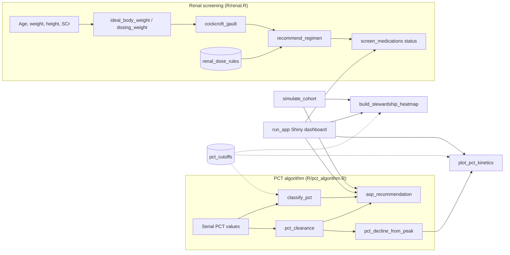

# Procalcitonin (PCT) Stewardship for Resource-Limited Wards

[](https://github.com/dr-somashekhar/clinical-biomarker-stewardship/actions/workflows/R-CMD-check.yaml)
[](https://github.com/dr-somashekhar/clinical-biomarker-stewardship/actions/workflows/lint-coverage.yaml)
[](LICENSE.md)

> ⚠️ **Research and educational use only.** This software is not a medical device and has not been validated for clinical decision-making. Dosing outputs must be verified by a qualified clinician against current product labelling and the local formulary. Do not enter identifiable patient data.

Simulating kinetic clearance curves and clinical decision logic for procalcitonin-guided antibiotic de-escalation in resource-limited wards. This repository contains the clinical logic, implementation frameworks, and data simulation protocols based on our 2026 narrative review published in the *Indo American Journal of Pharmaceutical Sciences*. 📊

## Project Overview
In tight resource settings, empirical antibiotic overuse accelerates antimicrobial resistance (AMR). This project digitizes a **Procalcitonin-Guided Antibiotic Stewardship Algorithm** designed to safely guide antibiotic de-escalation in secondary and tertiary care wards (such as ESI hospitals).

## Core Algorithmic Logic
The clinical decision support engine applies specific PCT cutoffs (ng/mL) to optimize prescribing:
*  **< 0.1 ng/mL:** Bacterial infection highly unlikely; strongly encourage withholding or stopping antibiotics.
*  **0.1 – 0.25 ng/mL:** Bacterial infection unlikely; discourage initiation.
*  **0.25 – 0.5 ng/mL:** Possible bacterial infection; use clinical discretion.
*  **> 0.5 ng/mL:** Bacterial infection highly likely; safely continue or escalate therapy.
*  **The 80% Rule:** Regardless of the absolute value, a drop of **≥80% from the peak PCT value** is a validated signal that the infection is resolving and antibiotics can be safely stopped.

Bands are left-closed: a value exactly on a cut-off falls in the higher band (0.5 ng/mL counts as "likely"). The cut-offs live in one place, `pct_cutoffs` (`R/pct_algorithm.R`), and the algorithm, heatmap and kinetics plot all read them from there.

By default the stop signal also fires when PCT falls below 0.25 ng/mL, even without an 80% decline. Pass `abs_stop = 0` to rely on the 80% rule alone.

## Architecture



## Installation
Requires R ≥ 4.1.

```r
# install.packages("remotes")
remotes::install_github("dr-somashekhar/clinical-biomarker-stewardship")
```

Or, from a local clone:

```r
# install.packages("devtools")
devtools::install()
```

## Quickstart

```r
library(pctsteward)

# 68yo female, 105 kg, 160 cm, SCr 1.8 mg/dL; ordered cefepime 2 g IV q8h
res <- screen_medications(
  age_yrs = 68, weight_kg = 105, height_cm = 160, scr_mgdl = 1.8,
  sex_is_female = TRUE, drug_name = "cefepime", prescribed_regimen_id = "2g_q8h"
)
res$crcl_ml_min          #> 34.7
res$recommended_label    #> "2 g IV q12h"
res$status               #> "intervention_required"

# Supported regimens and CrCl bands
renal_dose_rules
```

`status` is one of `"approved"`, `"intervention_required"` or `"no_protocol"`. Orders are passed as a regimen ID from `renal_dose_rules$regimen_id` (e.g. `"2g_q8h"`), not free text.

PCT algorithm:

```r
classify_pct(c(0.05, 0.3, 0.8))
#> [1] highly_unlikely possible        likely

pct_decline_from_peak(c(2.5, 1.8, 0.4, 0.15))$stop_signal   #> TRUE
asp_recommendation(c(2.5, 1.8, 0.4, 0.15))
#> [1] "Continue"    "Continue"    "Discontinue" "Discontinue"
```

Synthetic cohort and risk heatmap:

```r
cohort <- simulate_cohort(n = 500, seed = 2026)   # long format, see DATA_DICTIONARY.md
build_stewardship_heatmap(cohort)
plot_pct_kinetics()                               # two example patients
```

To save the PCT kinetics figure to `output/pct_kinetics.png`:

```sh
Rscript inst/scripts/pct_simulation.R
```

## Shiny App
An interactive dashboard with three tabs: the PCT stop rule for one patient's serial values, renal dose screening for one order, and the PCT × SOFA risk heatmap for a simulated or uploaded cohort.

```r
install.packages("shiny")   # the app's only extra dependency
pctsteward::run_app()       # opens in your web browser; press Esc in R to stop
```

This works from the R console, RStudio (including the Source button) and the command line (`Rscript -e "pctsteward::run_app()"`).

To deploy to Shiny Server, shinyapps.io or Posit Connect, install the package on the server from GitHub (`remotes::install_github("dr-somashekhar/clinical-biomarker-stewardship")`) and point it at `inst/app/`, which calls `run_app(launch = FALSE)`. Uploaded CSVs stay in the R session's memory and are never written to disk by the app, but upload synthetic or fully de-identified data only.

## Repository Contents
| Path | Purpose |
| :--- | :--- |
| `R/pct_algorithm.R` | PCT cut-offs, band classification, 80% decline rule, per-timepoint stewardship recommendation |
| `R/renal.R` | Renal dosing calculator: Devine IBW, AdjBW, Cockcroft-Gault, rule-table dose screening (`screen_medications()`) |
| `R/heatmap.R` | Admission PCT × baseline SOFA mortality heatmap with small-cell suppression (`build_stewardship_heatmap()`) |
| `R/simulate.R` | Synthetic long-format cohort generator (`simulate_cohort()`) |
| `R/simulation.R` | PCT kinetics plot coloured by the stop rule (`plot_pct_kinetics()`) |
| `R/app.R` | Shiny dashboard (`run_app()`), one module per tab |
| `inst/app/app.R` | Deployment entry point for the Shiny app |
| `inst/scripts/pct_simulation.R` | Saves the kinetics figure for a responder and a non-responder |
| `tests/testthat/` | Unit tests |
| `vignettes/` | End-to-end workflow vignette |
| `DATA_DICTIONARY.md` | Variables, units and coding for the simulated datasets |

## Development

```r
devtools::document()   # regenerate NAMESPACE and man/ from roxygen comments
devtools::test()       # run the test suite
devtools::check()      # full R CMD check
```

A full walkthrough is in the vignette: `vignette("stewardship-workflow", package = "pctsteward")`, also published on the [documentation site](https://dr-somashekhar.github.io/clinical-biomarker-stewardship/).

Every pull request runs `R CMD check` (Linux, macOS, Windows; R 4.1 to release), `lintr`, and a 90% test-coverage floor. See [CONTRIBUTING.md](CONTRIBUTING.md) and [SECURITY.md](SECURITY.md).

## Releasing
1. Bump `Version` in `DESCRIPTION` and `CITATION.cff`, and add a section to `NEWS.md`.
2. Push a matching tag, e.g. `git tag v0.1.0 && git push origin v0.1.0`.
3. The `release` workflow checks the tag matches `DESCRIPTION`, runs `R CMD check`, and publishes a GitHub release with the source package and the `NEWS.md` notes.

## Citation
If you use this software, please cite it using the metadata in [CITATION.cff](CITATION.cff) (GitHub's "Cite this repository" button).

## License
MIT — see [LICENSE.md](LICENSE.md).
